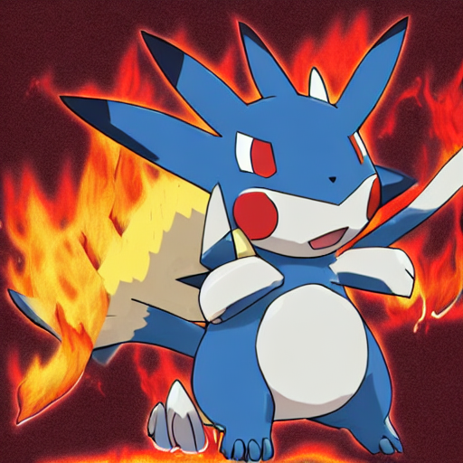

# Personal Projects Portfolio ✅

As a machine learning engineer, my passion lies in artificial intelligence and data science. Throughout my career, I have worked on various projects that have provided me with a wide range of skills. I have experience in several areas, including: (1) Creating chatbots using large language models, (2) Fine-tuning stable diffusion pipelines to generate artificial intelligence images, (3) Performing computer vision tasks such as object detection, tracking, segmentation, and general image processing, (4) Applying graph theory in social networks, and (5) Training supervised and unsupervised models, ranging from linear models to deep neural networks. Furthermore, I am always eager to learn new things and take on new challenges, and I am dedicated to giving my best in every task. My results-oriented approach has been complemented by the development of strong skills in teamwork, leadership, empathy, and adaptability.

## 1) Bank Churn Prediction

- Objective: Predict customer churn in a bank.
- Tools:, mlflow, AWS EC2, scikit-learn, pandas, xgboost, FastAPI, Python
  [Bank churn](https://github.com/luis95garay/data_science_bank_churn)
  

## 2) Langchain Virtual Assistant

- Objective: Develop a virtual assistant powered by Langchain and OpenAI.
- Tools: Langchain, OpenAI, faiss, Python
  [Virtual assistant](https://github.com/luis95garay/amazon-langchain-chatbot)
  

## 3) Object Detection for Stock Detection in an Automatic Store

- Objective: Implement object detection for stock monitoring in an automatic store.
- Tools: YOLOV7, YOLOV7-tiny, TAO YOLOV4, TAO YOLOV4-tiny, TAO SSD, PyTorch
  [Object detection](https://github.com/luis95garay/object_detection)

## 4) Time Series Analysis for Mauna Loa CO2 Concentration

- Objective: Analyze and predict Mauna Loa CO2 concentration over time.
- Tools: ARIMA, scikit-learn, Linear Regression, Python
  [Time series](https://github.com/luis95garay/Time-series-for-Mauna-Loa-CO2-concentration)
  

## 5) Clustering and Visualization for Gene Analysis

- Objective: Perform clustering and visualization for gene analysis.
- Tools: scikit-learn, PCA (Principal Component Analysis), MDS (Multi-Dimensional Scaling), t-SNE (t-distributed Stochastic Neighbor Embedding), Kmeans, Hierarchical Clustering
  [Clustering](https://github.com/luis95garay/Clustering-and-visualization-for-gene-analysis)
  

## 6) Graph theory in criminal network

- Objective: Perform graph theory in Criminal Data from CAVIAR Investigation
- Tools: networkx, matplotlib, python
  [Graph Theory](https://github.com/luis95garay/Graph-theory-criminal-network)
  

## 7) Generative AI fine tunning

- Objective: Perform a stable diffusion fine tunning with pokemon dataset
- Tools: PyTorch, Python, stable diffusion, LORA, transformers
  [Generative AI](https://github.com/luis95garay/generative_fine_tuning)
  

## 8) Image Classification (CIFAR Dataset)

- Objective: Perform image classification using the CIFAR dataset.
- Tools: PyTorch, Python, Matplotlib, mlflow, NumPy
  [Image classification](https://github.com/luis95garay/cifar-CNN)
  
